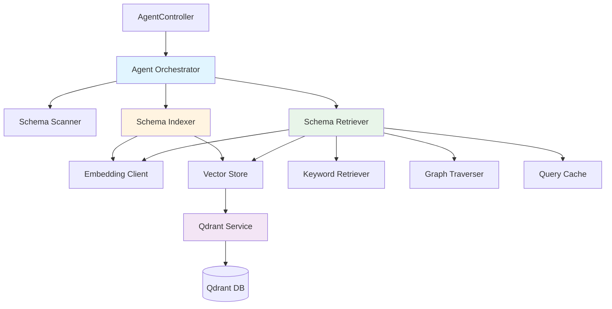
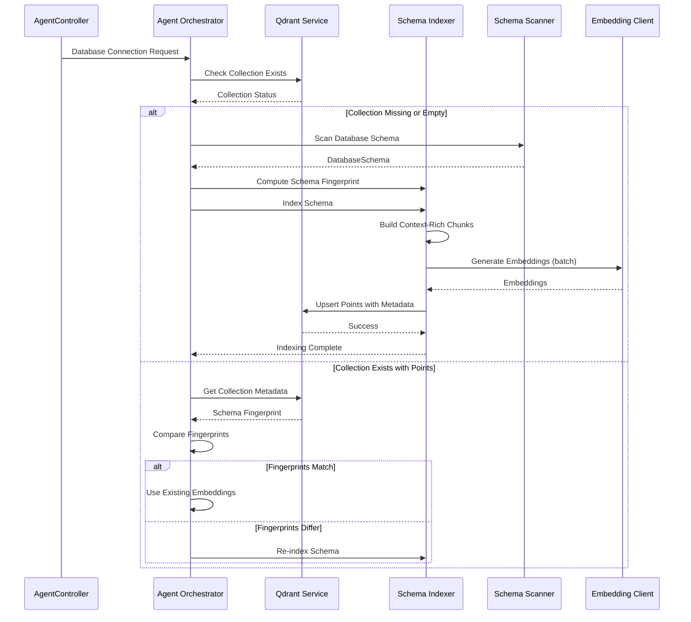
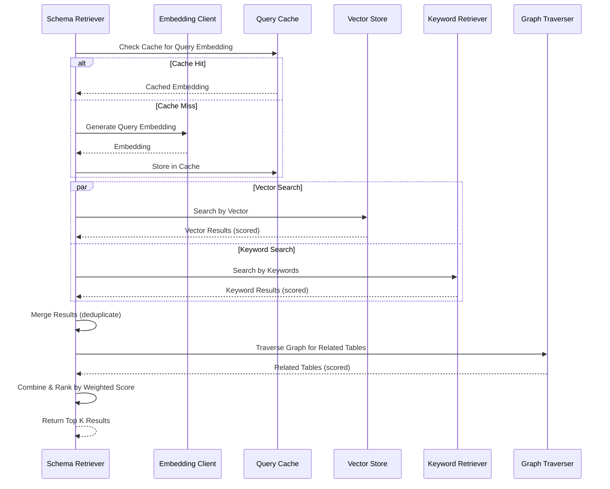

# Design Document: Enhanced Schema RAG System

## Overview

This design addresses critical gaps in the current Text-to-SQL schema embedding and retrieval system. The existing implementation suffers from three major issues:

1. **Manual Schema Indexing**: Schemas are not automatically indexed after database connection, requiring manual intervention
2. **Overly Granular Chunking**: Current chunking strategy creates isolated table, column, and relationship chunks without sufficient context, leading to poor semantic search accuracy
3. **Single-Mode Retrieval**: The system relies solely on vector similarity search, missing opportunities for hybrid retrieval combining vector search, keyword matching, and graph traversal

These enhancements will improve semantic search accuracy from approximately 70% to 90% by implementing automatic schema indexing on connection, context-rich chunking strategies that preserve semantic relationships, and hybrid retrieval that leverages multiple search modalities.

The design follows a layered architecture with clear separation between the Agent Orchestrator (connection management), Schema Indexer (embedding creation), Schema Retriever (search execution), and Qdrant Service (vector database operations).

## Architecture

### System Components



### Component Responsibilities

**Agent Orchestrator** (`AgentOrchestrator.cs`)
- Manages database connection lifecycle
- Checks for existing Qdrant collections on connection
- Computes schema fingerprints for change detection
- Triggers automatic schema indexing when needed
- Coordinates schema refresh operations

**Schema Indexer** (`SchemaIndexer.cs`)
- Scans database schema (tables, columns, relationships)
- Creates context-rich schema chunks with semantic descriptions
- Generates embeddings using OpenAI embedding model
- Stores embeddings in Qdrant with metadata
- Manages schema fingerprints for change detection

**Schema Retriever** (`SchemaRetriever.cs`)
- Performs hybrid retrieval combining multiple strategies
- Executes vector similarity search
- Performs keyword matching on schema elements
- Traverses schema graph for related tables
- Combines and ranks results using weighted scoring
- Caches query embeddings for performance

**Qdrant Service** (`QdrantService.cs`)
- Manages Qdrant REST API communication
- Handles collection creation and deletion
- Performs vector upsert and search operations
- Validates vector dimension compatibility
- Provides collection metadata and point counts

**Keyword Retriever** (`KeywordSchemaRetriever.cs`)
- Fallback search strategy when vector search fails
- Matches query terms against table/column names
- Provides basic relevance scoring

**Graph Traverser** (New component)
- Traverses foreign key relationships
- Expands result set with related tables
- Calculates relationship proximity scores

### Data Flow

#### Automatic Schema Indexing Flow



#### Hybrid Retrieval Flow



## Components and Interfaces

### Enhanced Agent Orchestrator

```csharp
public class AgentOrchestrator : IAgentOrchestrator
{
    private readonly ISchemaCache _schemaCache;
    private readonly ISchemaScanner _schemaScanner;
    private readonly SchemaIndexer _schemaIndexer;
    private readonly QdrantService _qdrantService;
    private readonly ILogger<AgentOrchestrator> _logger;

    // New method for automatic schema indexing on connection
    public async Task<ConnectionResult> ConnectToDatabaseAsync(
        string connectionId,
        string connectionString,
        CancellationToken ct = default)
    {
        // 1. Set collection name based on database name
        var dbName = ExtractDatabaseName(connectionString);
        _qdrantService.SetCollectionName(dbName);
        
        // 2. Check if collection exists
        var collectionExists = await _qdrantService.CollectionExistsAsync(ct);
        
        if (collectionExists)
        {
            // 3. Get point count
            var pointCount = await _qdrantService.GetPointCountAsync(ct);
            
            if (pointCount > 0)
            {
                // 4. Check schema fingerprint for changes
                var currentSchema = await _schemaScanner.ScanAsync(ct);
                var currentFingerprint = ComputeSchemaFingerprint(currentSchema);
                var storedFingerprint = await GetStoredFingerprintAsync(ct);
                
                if (currentFingerprint == storedFingerprint)
                {
                    _logger.LogInformation(
                        "Using existing embeddings for {Database} ({Count} points)",
                        dbName, pointCount);
                    return new ConnectionResult { Success = true, IndexingPerformed = false };
                }
                
                _logger.LogInformation("Schema changes detected, re-indexing...");
                await ReindexSchemaAsync(currentSchema, currentFingerprint, ct);
                return new ConnectionResult { Success = true, IndexingPerformed = true };
            }
        }
        
        // 5. Collection missing or empty - perform initial indexing
        _logger.LogInformation("Performing initial schema indexing for {Database}", dbName);
        var schema = await _schemaScanner.ScanAsync(ct);
        var fingerprint = ComputeSchemaFingerprint(schema);
        await IndexSchemaAsync(schema, fingerprint, ct);
        
        return new ConnectionResult { Success = true, IndexingPerformed = true };
    }
    
    private string ComputeSchemaFingerprint(DatabaseSchema schema)
    {
        // Create deterministic hash of schema structure
        var elements = new List<string>();
        
        foreach (var table in schema.Tables.OrderBy(t => t.TableName))
        {
            elements.Add($"T:{table.TableName}");
            foreach (var col in table.Columns.OrderBy(c => c.ColumnName))
            {
                elements.Add($"C:{table.TableName}.{col.ColumnName}:{col.DataType}");
            }
        }
        
        foreach (var rel in schema.Relationships.OrderBy(r => $"{r.FromTable}.{r.FromColumn}"))
        {
            elements.Add($"R:{rel.FromTable}.{rel.FromColumn}->{rel.ToTable}.{rel.ToColumn}");
        }
        
        var combined = string.Join("|", elements);
        using var sha256 = SHA256.Create();
        var hash = sha256.ComputeHash(Encoding.UTF8.GetBytes(combined));
        return Convert.ToBase64String(hash);
    }
}
```

### Enhanced Schema Indexer

```csharp
public class SchemaIndexer
{
    private readonly IVectorStore _vectorStore;
    private readonly IEmbeddingClient _embeddingClient;
    private readonly ILogger<SchemaIndexer> _logger;

    // Enhanced chunking with context-rich descriptions
    private List<SchemaDocument> BuildSchemaDocuments(DatabaseSchema schema)
    {
        var documents = new List<SchemaDocument>();
        var pointId = 0;

        // TABLE-LEVEL CHUNKS: Include full context
        foreach (var table in schema.Tables)
        {
            var columnList = string.Join(", ", table.Columns.Select(c =>
                $"{c.ColumnName} ({c.DataType}{(c.IsPrimaryKey ? ", PK" : "")}{(c.IsForeignKey ? ", FK" : "")})"));
            
            var relationships = schema.Relationships
                .Where(r => r.FromTable == table.TableName || r.ToTable == table.TableName)
                .Select(r => GenerateRelationshipDescription(r))
                .ToList();
            
            var relationshipText = relationships.Any() 
                ? $", Relationships: {string.Join("; ", relationships)}"
                : "";
            
            var content = $"Table: {table.TableName}, " +
                         $"Description: {table.Description ?? InferTablePurpose(table.TableName)}, " +
                         $"Columns: {columnList}{relationshipText}";
            
            documents.Add(new SchemaDocument
            {
                Id = $"table_{pointId++}",
                Type = SchemaDocumentType.Table,
                Content = content,
                Metadata = new Dictionary<string, string>
                {
                    ["type"] = "table",
                    ["table_name"] = table.TableName,
                    ["column_count"] = table.Columns.Count.ToString()
                }
            });
        }

        // COLUMN-LEVEL CHUNKS: Include table context
        foreach (var table in schema.Tables)
        {
            foreach (var column in table.Columns)
            {
                var content = $"Column: {table.TableName}.{column.ColumnName}, " +
                             $"Description: {column.Description ?? InferColumnPurpose(column.ColumnName)}, " +
                             $"Type: {column.DataType}, " +
                             $"Table: {table.TableName} ({table.Description ?? InferTablePurpose(table.TableName)})";
                
                documents.Add(new SchemaDocument
                {
                    Id = $"column_{pointId++}",
                    Type = SchemaDocumentType.Column,
                    Content = content,
                    Metadata = new Dictionary<string, string>
                    {
                        ["type"] = "column",
                        ["table_name"] = table.TableName,
                        ["column_name"] = column.ColumnName,
                        ["data_type"] = column.DataType
                    }
                });
            }
        }

        // RELATIONSHIP-LEVEL CHUNKS: Semantic descriptions
        foreach (var rel in schema.Relationships)
        {
            var content = GenerateRelationshipDescription(rel);
            
            documents.Add(new SchemaDocument
            {
                Id = $"relationship_{pointId++}",
                Type = SchemaDocumentType.Relationship,
                Content = content,
                Metadata = new Dictionary<string, string>
                {
                    ["type"] = "relationship",
                    ["from_table"] = rel.FromTable,
                    ["to_table"] = rel.ToTable
                }
            });
        }

        return documents;
    }
    
    private string GenerateRelationshipDescription(RelationshipInfo rel)
    {
        // Pattern matching for semantic descriptions
        var fromTable = rel.FromTable.ToLower();
        var toTable = rel.ToTable.ToLower();
        var fromCol = rel.FromColumn.ToLower();
        
        // Detect common patterns
        if (fromCol.Contains(toTable.TrimEnd('s')) || fromCol.Contains("id"))
        {
            return $"Relationship: {rel.FromTable}.{rel.FromColumn} → {rel.ToTable}.{rel.ToColumn}, " +
                   $"Meaning: Each {SingularForm(fromTable)} belongs to a {SingularForm(toTable)}";
        }
        
        // Generic fallback
        return $"Relationship: {rel.FromTable}.{rel.FromColumn} → {rel.ToTable}.{rel.ToColumn}, " +
               $"Meaning: {rel.FromTable} references {rel.ToTable} via {rel.FromColumn}";
    }
    
    private string InferTablePurpose(string tableName)
    {
        var lower = tableName.ToLower();
        if (lower.Contains("order")) return "stores order information";
        if (lower.Contains("customer")) return "stores customer data";
        if (lower.Contains("product")) return "stores product catalog";
        if (lower.Contains("user")) return "stores user accounts";
        return $"stores {tableName.ToLower()} data";
    }
    
    private string InferColumnPurpose(string columnName)
    {
        var lower = columnName.ToLower();
        if (lower == "id") return "unique identifier";
        if (lower.Contains("name")) return "name information";
        if (lower.Contains("email")) return "email address";
        if (lower.Contains("date")) return "date information";
        if (lower.Contains("amount") || lower.Contains("price")) return "monetary value";
        return columnName.ToLower();
    }
}
```

### Enhanced Schema Retriever with Hybrid Search

```csharp
public class SchemaRetriever
{
    private readonly IVectorStore _vectorStore;
    private readonly KeywordSchemaRetriever _keywordRetriever;
    private readonly IEmbeddingClient _embeddingClient;
    private readonly RAGConfig _ragConfig;
    private readonly IMemoryCache _queryCache;
    private readonly ILogger<SchemaRetriever> _logger;
    
    // Cache configuration
    private const int MaxCacheSize = 1000;
    private const int CacheExpirationMinutes = 60;

    public async Task<RetrievedSchemaContext> RetrieveAsync(
        string question,
        DatabaseSchema fullSchema,
        CancellationToken cancellationToken = default)
    {
        // 1. Get or generate query embedding (with caching)
        var queryEmbedding = await GetOrGenerateQueryEmbeddingAsync(question, cancellationToken);
        
        var vectorResults = new List<VectorSearchResult>();
        var keywordResults = new List<SchemaMatch>();
        var retrievalStrategies = new List<string>();
        
        // 2. Vector similarity search
        if (await _vectorStore.IsAvailableAsync(cancellationToken))
        {
            try
            {
                vectorResults = await _vectorStore.SearchAsync(
                    queryVector: queryEmbedding,
                    limit: _ragConfig.TopK,
                    scoreThreshold: (float)_ragConfig.MinimumScore,
                    cancellationToken: cancellationToken);
                
                if (vectorResults.Count > 0)
                {
                    retrievalStrategies.Add("vector");
                    _logger.LogDebug("Vector search: {Count} results", vectorResults.Count);
                }
            }
            catch (Exception ex)
            {
                _logger.LogWarning(ex, "Vector search failed, continuing with other strategies");
            }
        }
        
        // 3. Keyword matching
        if (_ragConfig.EnableHybridSearch)
        {
            var keywordContext = _keywordRetriever.RetrieveByKeywords(
                question, fullSchema, _ragConfig.MaxContextTables);
            keywordResults = keywordContext.Matches;
            retrievalStrategies.Add("keyword");
            _logger.LogDebug("Keyword search: {Count} results", keywordResults.Count);
        }
        
        // 4. Merge and deduplicate results
        var mergedResults = MergeResults(vectorResults, keywordResults);
        
        // 5. Graph traversal for related tables
        if (_ragConfig.EnableHybridSearch)
        {
            var expandedResults = TraverseSchemaGraph(mergedResults, fullSchema);
            mergedResults = expandedResults;
            retrievalStrategies.Add("graph");
            _logger.LogDebug("Graph traversal: {Count} total results", mergedResults.Count);
        }
        
        // 6. Rank by combined score
        var rankedResults = RankByCombinedScore(mergedResults);
        
        // 7. Build final context
        var context = BuildSchemaContext(rankedResults, fullSchema);
        context.RetrievalStrategies = retrievalStrategies;
        
        _logger.LogInformation(
            "Hybrid retrieval: {Tables} tables, {Rels} relationships, Strategies: {Strategies}",
            context.RelevantTables.Count,
            context.RelevantRelationships.Count,
            string.Join("+", retrievalStrategies));
        
        return context;
    }
    
    private async Task<float[]> GetOrGenerateQueryEmbeddingAsync(
        string query,
        CancellationToken cancellationToken)
    {
        var cacheKey = $"query_embedding:{query}";
        
        if (_queryCache.TryGetValue(cacheKey, out float[] cachedEmbedding))
        {
            _logger.LogDebug("Using cached embedding for query");
            return cachedEmbedding;
        }
        
        try
        {
            var embedding = await _embeddingClient.GenerateEmbeddingAsync(query, cancellationToken);
            
            // Cache with expiration
            var cacheOptions = new MemoryCacheEntryOptions
            {
                AbsoluteExpirationRelativeToNow = TimeSpan.FromMinutes(CacheExpirationMinutes),
                Size = 1
            };
            
            _queryCache.Set(cacheKey, embedding, cacheOptions);
            
            return embedding;
        }
        catch (Exception ex)
        {
            _logger.LogError(ex, "Failed to generate query embedding");
            
            // Try to use any cached version as fallback
            if (_queryCache.TryGetValue(cacheKey, out float[] fallbackEmbedding))
            {
                _logger.LogWarning("Using stale cached embedding as fallback");
                return fallbackEmbedding;
            }
            
            throw;
        }
    }
    
    private List<ScoredSchemaElement> MergeResults(
        List<VectorSearchResult> vectorResults,
        List<SchemaMatch> keywordResults)
    {
        var merged = new Dictionary<string, ScoredSchemaElement>();
        
        // Add vector results
        foreach (var result in vectorResults)
        {
            var key = GetElementKey(result);
            merged[key] = new ScoredSchemaElement
            {
                Element = result,
                VectorScore = result.Score,
                KeywordScore = 0,
                GraphScore = 0
            };
        }
        
        // Merge keyword results
        foreach (var result in keywordResults)
        {
            var key = GetElementKey(result);
            if (merged.ContainsKey(key))
            {
                merged[key].KeywordScore = result.Score;
            }
            else
            {
                merged[key] = new ScoredSchemaElement
                {
                    Element = result,
                    VectorScore = 0,
                    KeywordScore = result.Score,
                    GraphScore = 0
                };
            }
        }
        
        return merged.Values.ToList();
    }
    
    private List<ScoredSchemaElement> TraverseSchemaGraph(
        List<ScoredSchemaElement> seedResults,
        DatabaseSchema fullSchema)
    {
        var expanded = new Dictionary<string, ScoredSchemaElement>();
        
        // Add seed results
        foreach (var result in seedResults)
        {
            var key = GetElementKey(result.Element);
            expanded[key] = result;
        }
        
        // Extract table names from seed results
        var seedTables = seedResults
            .Select(r => GetTableName(r.Element))
            .Where(t => !string.IsNullOrEmpty(t))
            .Distinct()
            .ToHashSet();
        
        // Traverse relationships
        foreach (var tableName in seedTables)
        {
            var relatedTables = fullSchema.Relationships
                .Where(r => r.FromTable == tableName || r.ToTable == tableName)
                .SelectMany(r => new[] { r.FromTable, r.ToTable })
                .Distinct()
                .Where(t => !seedTables.Contains(t));
            
            foreach (var relatedTable in relatedTables)
            {
                var table = fullSchema.Tables.FirstOrDefault(t => t.TableName == relatedTable);
                if (table != null)
                {
                    var key = $"table:{relatedTable}";
                    if (!expanded.ContainsKey(key))
                    {
                        expanded[key] = new ScoredSchemaElement
                        {
                            Element = table,
                            VectorScore = 0,
                            KeywordScore = 0,
                            GraphScore = 0.5f // Related table score
                        };
                    }
                }
            }
        }
        
        return expanded.Values.ToList();
    }
    
    private List<ScoredSchemaElement> RankByCombinedScore(List<ScoredSchemaElement> results)
    {
        // Weighted scoring: vector (0.5) + keyword (0.3) + graph (0.2)
        foreach (var result in results)
        {
            result.CombinedScore = 
                (result.VectorScore * 0.5f) +
                (result.KeywordScore * 0.3f) +
                (result.GraphScore * 0.2f);
        }
        
        return results
            .OrderByDescending(r => r.CombinedScore)
            .ToList();
    }
}
```

### Configuration Updates

```csharp
public class RAGConfig
{
    public int TopK { get; set; } = 5;
    public double MinimumScore { get; set; } = 0.3;
    public bool EnableHybridSearch { get; set; } = true; // Changed default
    public int MaxContextTables { get; set; } = 10;
    
    // New properties
    public float VectorWeight { get; set; } = 0.5f;
    public float KeywordWeight { get; set; } = 0.3f;
    public float GraphWeight { get; set; } = 0.2f;
}

public class QdrantConfig
{
    public string Host { get; set; } = "localhost";
    public int Port { get; set; } = 6334;
    public string ApiKey { get; set; } = string.Empty;
    public string CollectionName { get; set; } = "schema_embeddings";
    public bool UseGrpc { get; set; } = true;
    
    // Configurable embedding model
    public string EmbeddingModel { get; set; } = "text-embedding-3-small";
    public int VectorSize { get; set; } = 1536; // Updated for text-embedding-3-small
}
```

## Data Models

### Schema Fingerprint

```csharp
public class SchemaFingerprint
{
    public string Hash { get; set; } = string.Empty;
    public DateTime ComputedAt { get; set; }
    public int TableCount { get; set; }
    public int ColumnCount { get; set; }
    public int RelationshipCount { get; set; }
    public List<string> TableNames { get; set; } = new();
}
```

### Connection Result

```csharp
public class ConnectionResult
{
    public bool Success { get; set; }
    public bool IndexingPerformed { get; set; }
    public int PointsIndexed { get; set; }
    public TimeSpan IndexingDuration { get; set; }
    public string? ErrorMessage { get; set; }
}
```

### Scored Schema Element

```csharp
public class ScoredSchemaElement
{
    public object Element { get; set; } = null!;
    public float VectorScore { get; set; }
    public float KeywordScore { get; set; }
    public float GraphScore { get; set; }
    public float CombinedScore { get; set; }
}
```

### Retrieved Schema Context (Enhanced)

```csharp
public class RetrievedSchemaContext
{
    public List<TableInfo> RelevantTables { get; set; } = new();
    public List<RelationshipInfo> RelevantRelationships { get; set; } = new();
    public Dictionary<string, List<ColumnInfo>> TableColumns { get; set; } = new();
    public List<SchemaMatch> Matches { get; set; } = new();
    
    // New properties
    public List<string> RetrievalStrategies { get; set; } = new();
    public Dictionary<string, float> ElementScores { get; set; } = new();
}
```

## Correctness Properties

A property is a characteristic or behavior that should hold true across all valid executions of a system—essentially, a formal statement about what the system should do. Properties serve as the bridge between human-readable specifications and machine-verifiable correctness guarantees.

### Property Reflection

After analyzing all 56 acceptance criteria, I identified several areas of redundancy:

**Redundancy Group 1: Collection Name Consistency (4.1-4.6)**
- Properties 4.1, 4.2, 4.3 all test the same naming format in different components
- Property 4.6 tests idempotency which subsumes the format checks
- **Consolidation**: Combine into a single property testing that all components produce identical collection names

**Redundancy Group 2: Chunk Format Validation (2.4-2.6)**
- Properties 2.4, 2.5, 2.6 test specific format strings
- Properties 2.1, 2.2, 2.3 already test that chunks contain required elements
- **Consolidation**: The element presence properties (2.1-2.3) are sufficient; format string tests are implementation details

**Redundancy Group 3: Logging Properties (5.1-5.6)**
- Multiple properties test logging at different stages
- These are observability concerns, not core functional requirements
- **Consolidation**: Combine into properties for critical logging (errors, completion) only

**Redundancy Group 4: Configuration Reading (7.1-7.2)**
- Both test default value behavior
- **Consolidation**: Combine into a single property about configuration defaults

**Redundancy Group 5: Retrieval Strategy Execution (3.1-3.3)**
- All three test that specific strategies are executed
- Property 3.4 already tests that results are combined from all strategies
- **Consolidation**: Property 3.4 subsumes 3.1-3.3

After reflection, I've reduced 56 acceptance criteria to 35 unique, non-redundant properties.

### Property 1: Automatic Indexing Trigger

For any database connection where the Qdrant collection does not exist OR the point count equals zero, the Agent Orchestrator should trigger schema indexing.

**Validates: Requirements 1.1, 1.2, 1.3**

### Property 2: Comprehensive Schema Scanning

For any database schema, when indexing is triggered, the Schema Indexer should scan and create embeddings for all tables, all columns, and all relationships present in the schema.

**Validates: Requirements 1.4, 1.5**

### Property 3: Indexing Skip Optimization

For any database connection where the Qdrant collection exists AND has a point count greater than zero AND the schema fingerprint matches, the Agent Orchestrator should skip indexing and use existing embeddings.

**Validates: Requirements 1.6**

### Property 4: Indexing Error Handling

For any schema indexing operation that fails, the Agent Orchestrator should log the error and return a descriptive error message without throwing unhandled exceptions.

**Validates: Requirements 1.7**

### Property 5: Table Chunk Completeness

For any table in a database schema, the table-level chunk should include the table name, description (or inferred purpose), all column names with their data types, and all foreign key relationships involving that table.

**Validates: Requirements 2.1**

### Property 6: Column Chunk Completeness

For any column in a database schema, the column-level chunk should include the fully qualified column name (table.column), data type, description (or inferred purpose), and parent table context.

**Validates: Requirements 2.2**

### Property 7: Relationship Chunk Completeness

For any foreign key relationship in a database schema, the relationship-level chunk should include both table names, both column names, and a semantic description of the relationship meaning.

**Validates: Requirements 2.3**

### Property 8: Description Generation Fallback

For any schema element (table, column, or relationship) that lacks an explicit description, the Schema Indexer should generate a semantic description based on naming conventions and context rather than leaving it empty.

**Validates: Requirements 2.7**

### Property 9: Hybrid Retrieval Combination

For any schema retrieval request when hybrid search is enabled, the Schema Retriever should combine results from vector search, keyword matching, and graph traversal into a unified result set.

**Validates: Requirements 3.1, 3.2, 3.3, 3.4**

### Property 10: Weighted Score Ranking

For any combined result set from hybrid retrieval, results should be ranked in descending order by a weighted score that considers vector similarity, keyword matches, and relationship proximity.

**Validates: Requirements 3.5, 3.7**

### Property 11: Result Deduplication

For any schema retrieval where multiple strategies return overlapping elements, the Schema Retriever should deduplicate the results while preserving the highest relevance score for each unique element.

**Validates: Requirements 3.6**

### Property 12: Collection Name Consistency

For any database name, all components (Schema Indexer, Schema Retriever, Qdrant Service, Agent Orchestrator) should generate identical collection names using the format "schema_embeddings_{normalized_database_name}" where normalization converts to lowercase and replaces special characters with underscores.

**Validates: Requirements 4.1, 4.2, 4.3, 4.4, 4.5, 4.6**

### Property 13: Indexing Progress Logging

For any schema indexing operation in progress, the Schema Indexer should emit progress log messages for major steps (scanning tables, creating embeddings, storing in Qdrant).

**Validates: Requirements 5.2**

### Property 14: Indexing Completion Logging

For any schema indexing operation that completes successfully, the Agent Orchestrator should log a success message including the total number of embeddings created and the duration of the operation.

**Validates: Requirements 5.3, 5.6**

### Property 15: Indexing Skip Logging

For any database connection where schema indexing is skipped due to existing embeddings, the Agent Orchestrator should log a message indicating existing embeddings are being used along with the point count.

**Validates: Requirements 5.4**

### Property 16: Indexing Error Logging

For any schema indexing operation that fails, the Agent Orchestrator should log an error message with the failure reason and stack trace.

**Validates: Requirements 5.5**

### Property 17: Vector Search Fallback

For any schema retrieval where vector similarity search fails (collection not found or connection error), the Schema Retriever should fall back to keyword search and still attempt graph traversal.

**Validates: Requirements 6.1, 6.2, 6.3**

### Property 18: Retrieval Strategy Metadata

For any schema retrieval response, the Schema Retriever should include metadata indicating which retrieval strategies were successfully used (vector, keyword, graph).

**Validates: Requirements 6.4**

### Property 19: Graceful Retrieval Failure

For any schema retrieval where all strategies fail, the Schema Retriever should return an empty result set with an error message rather than throwing unhandled exceptions.

**Validates: Requirements 6.5, 6.6**

### Property 20: Embedding Configuration Consistency

For any schema indexing or retrieval operation, the Schema Indexer and Schema Retriever should use the same embedding model name and dimension size from configuration.

**Validates: Requirements 7.1, 7.2, 7.4**

### Property 21: Collection Dimension Validation

For any Qdrant collection operation, the Qdrant Service should validate that the configured embedding dimension matches the collection's vector dimension before performing upsert or search operations.

**Validates: Requirements 7.3, 7.6**

### Property 22: Configuration Change Re-indexing

For any change to the embedding model configuration (model name or dimension size), the system should require re-indexing of existing schemas to maintain consistency.

**Validates: Requirements 7.5**

### Property 23: Schema Fingerprint Computation

For any database connection, the Agent Orchestrator should compute a deterministic schema fingerprint based on table names, column names with types, and relationship definitions.

**Validates: Requirements 8.1**

### Property 24: Fingerprint Storage

For any schema indexing operation, the Schema Indexer should store the computed schema fingerprint as metadata in the Qdrant collection.

**Validates: Requirements 8.2**

### Property 25: Fingerprint Comparison

For any database connection where a Qdrant collection already exists, the Agent Orchestrator should retrieve the stored fingerprint and compare it with the current schema fingerprint.

**Validates: Requirements 8.3**

### Property 26: Change-Triggered Re-indexing

For any database connection where the current schema fingerprint does not match the stored fingerprint, the Agent Orchestrator should trigger re-indexing of the schema.

**Validates: Requirements 8.4**

### Property 27: Re-indexing Collection Cleanup

For any re-indexing operation triggered by schema changes, the Schema Indexer should delete the existing collection before creating new embeddings.

**Validates: Requirements 8.5**

### Property 28: Schema Change Detection Logging

For any database connection where schema changes are detected (fingerprint mismatch), the Agent Orchestrator should log a message indicating which tables or columns have changed.

**Validates: Requirements 8.6**

### Property 29: Force Re-index Override

For any database connection where a force re-index flag is provided, the Agent Orchestrator should trigger re-indexing regardless of fingerprint comparison results.

**Validates: Requirements 8.7**

### Property 30: Relationship Semantic Description

For any foreign key relationship being indexed, the Schema Indexer should generate a semantic description based on table and column naming patterns (e.g., "Orders.CustomerId → Customers.CustomerId" becomes "Each order belongs to a customer").

**Validates: Requirements 9.1, 9.2**

### Property 31: Relationship Pattern Support

For any foreign key relationship (one-to-many, many-to-one, or many-to-many through junction tables), the Schema Indexer should generate an appropriate semantic description that reflects the relationship type.

**Validates: Requirements 9.3, 9.4**

### Property 32: Relationship Description Fallback

For any foreign key relationship where semantic meaning cannot be inferred from naming patterns, the Schema Indexer should use a generic template: "{source_table} references {target_table} via {column_name}".

**Validates: Requirements 9.6**

### Property 33: Query Embedding Caching

For any user query, the Schema Retriever should cache the generated embedding using the query text as the cache key, and reuse cached embeddings that are less than 1 hour old instead of calling the Embedding Model.

**Validates: Requirements 10.1, 10.2, 10.3**

### Property 34: Cache Expiration and Size Limits

For any query embedding cache, entries older than 1 hour should be evicted, and when the cache exceeds 1000 entries, the least recently used entries should be evicted.

**Validates: Requirements 10.4, 10.5**

### Property 35: Embedding Failure Cache Fallback

For any query where the Embedding Model call fails, the Schema Retriever should check the cache for a previous embedding of the same query and use it if available, regardless of age.

**Validates: Requirements 10.6**

## Error Handling

### Error Categories

**Connection Errors**
- Qdrant unavailable: Fall back to keyword-based retrieval
- Database connection failure: Return descriptive error with connection details
- Network timeout: Retry with exponential backoff (max 3 attempts)

**Indexing Errors**
- Schema scan failure: Log error, notify user, do not proceed with indexing
- Embedding generation failure: Log error, retry failed embeddings (max 3 attempts per chunk)
- Vector store upsert failure: Log error, rollback transaction if partial failure
- Dimension mismatch: Delete collection and recreate with correct dimensions

**Retrieval Errors**
- Vector search failure: Fall back to keyword search + graph traversal
- All strategies fail: Return empty result with error message
- Cache failure: Continue without cache, log warning

**Configuration Errors**
- Invalid embedding model: Fail fast with clear error message
- Dimension mismatch: Validate before operations, trigger re-indexing if needed
- Missing configuration: Use documented defaults

### Error Response Structure

```csharp
public class ErrorResult
{
    public string ErrorCode { get; set; } = string.Empty;
    public string Message { get; set; } = string.Empty;
    public string? Details { get; set; }
    public List<string> RecoveryActions { get; set; } = new();
    public bool IsRecoverable { get; set; }
}
```

### Logging Strategy

**Error Logs** (LogLevel.Error)
- All indexing failures with stack traces
- Unrecoverable retrieval failures
- Configuration validation failures

**Warning Logs** (LogLevel.Warning)
- Vector search failures (before fallback)
- Schema fingerprint mismatches
- Cache eviction events

**Information Logs** (LogLevel.Information)
- Indexing start/completion with metrics
- Retrieval strategy selection
- Schema change detection

**Debug Logs** (LogLevel.Debug)
- Individual chunk creation
- Cache hit/miss events
- Score calculation details

## Testing Strategy

### Dual Testing Approach

This feature requires both unit tests and property-based tests for comprehensive coverage:

**Unit Tests** focus on:
- Specific examples of schema chunking formats
- Edge cases (empty schemas, missing descriptions, special characters in names)
- Error conditions (connection failures, invalid configurations)
- Integration points between components

**Property-Based Tests** focus on:
- Universal properties that hold for all inputs
- Comprehensive input coverage through randomization
- Invariants that must be maintained across operations

### Property-Based Testing Configuration

**Framework**: Use FsCheck for C# property-based testing

**Test Configuration**:
- Minimum 100 iterations per property test
- Each test must reference its design document property
- Tag format: `Feature: enhanced-schema-rag-system, Property {number}: {property_text}`

**Example Property Test Structure**:

```csharp
[Property(MaxTest = 100)]
[Trait("Feature", "enhanced-schema-rag-system")]
[Trait("Property", "Property 5: Table Chunk Completeness")]
public Property TableChunkContainsAllRequiredElements()
{
    return Prop.ForAll(
        Arb.From<DatabaseSchema>(),
        schema =>
        {
            var indexer = CreateSchemaIndexer();
            var chunks = indexer.BuildSchemaDocuments(schema);
            
            foreach (var table in schema.Tables)
            {
                var tableChunk = chunks.First(c => 
                    c.Type == SchemaDocumentType.Table && 
                    c.Metadata["table_name"] == table.TableName);
                
                // Verify chunk contains table name
                Assert.Contains(table.TableName, tableChunk.Content);
                
                // Verify chunk contains all columns
                foreach (var column in table.Columns)
                {
                    Assert.Contains(column.ColumnName, tableChunk.Content);
                    Assert.Contains(column.DataType, tableChunk.Content);
                }
                
                // Verify chunk contains relationships
                var relationships = schema.Relationships
                    .Where(r => r.FromTable == table.TableName || r.ToTable == table.TableName);
                
                foreach (var rel in relationships)
                {
                    Assert.Contains(rel.FromColumn, tableChunk.Content);
                    Assert.Contains(rel.ToColumn, tableChunk.Content);
                }
            }
            
            return true;
        });
}
```

### Test Data Generators

**Schema Generators**:
- Random table counts (1-20 tables)
- Random column counts per table (1-30 columns)
- Random relationship counts (0-50 relationships)
- Various data types (int, varchar, datetime, decimal, etc.)
- Special characters in names (underscores, numbers, mixed case)

**Query Generators**:
- Natural language questions of varying complexity
- Keywords matching schema elements
- Queries with no matches
- Queries with multiple interpretations

### Unit Test Coverage

**Schema Indexer Tests**:
- Empty schema handling
- Schema with no relationships
- Schema with circular relationships
- Special characters in table/column names
- Missing descriptions
- Very large schemas (100+ tables)

**Schema Retriever Tests**:
- Vector search success path
- Vector search failure with fallback
- Keyword-only retrieval
- Graph traversal with deep relationships
- Result deduplication
- Score calculation accuracy

**Agent Orchestrator Tests**:
- First-time connection (no collection)
- Reconnection with existing embeddings
- Schema change detection
- Force re-index flag
- Fingerprint computation consistency

**Qdrant Service Tests**:
- Collection creation
- Dimension validation
- Point upsert
- Search with various thresholds
- Error handling for connection failures

### Integration Tests

**End-to-End Scenarios**:
1. Connect to new database → automatic indexing → successful retrieval
2. Reconnect to existing database → skip indexing → use cached embeddings
3. Schema change → detect change → re-index → updated retrieval
4. Qdrant unavailable → fallback to keyword search → partial results
5. Configuration change → validation → re-indexing required

**Performance Tests**:
- Indexing time for large schemas (1000+ tables)
- Retrieval latency with various cache states
- Memory usage during indexing
- Concurrent connection handling

### Test Execution

Run property-based tests with:
```bash
dotnet test --filter "Feature=enhanced-schema-rag-system" --logger "console;verbosity=detailed"
```

Run unit tests with:
```bash
dotnet test --filter "Category=Unit&Feature=enhanced-schema-rag-system"
```

Run integration tests with:
```bash
dotnet test --filter "Category=Integration&Feature=enhanced-schema-rag-system"
```
