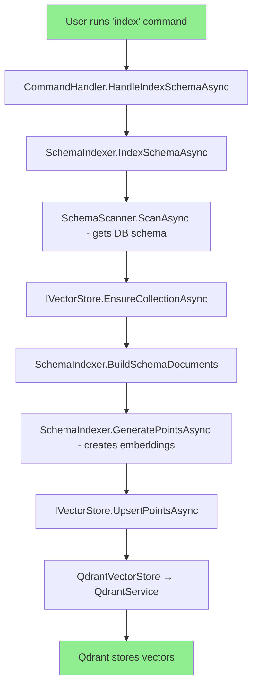

# Comprehensive Plan: Aligning API Project with Console Project for Qdrant Schema Management

## Executive Summary

This document outlines the analysis and action plan to fix the Qdrant schema synchronization issue in the API project. The root cause has been identified as a **DI configuration problem** in `SchemaRegistryService` where `QdrantService` and `IEmbeddingClient` are registered as nullable dependencies, causing the Qdrant upload to silently fail.

---

## Current State Analysis

### How Console Project Works (Working)



**Key Components:**

- [`SchemaIndexer`](TextToSqlAgent.Infrastructure/RAG/SchemaIndexer.cs) - Uses `IVectorStore` abstraction
- [`IVectorStore`](TextToSqlAgent.Infrastructure/VectorDB/IVectorStore.cs) - Interface with `FallbackVectorStore`
- [`QdrantVectorStore`](TextToSqlAgent.Infrastructure/VectorDB/QdrantVectorStore.cs) - Qdrant implementation
- Collection name: `schema_embeddings_large` (from config)

### How API Project Currently Works (Broken)

```mermaid
flowchart TD
    A[Frontend calls POST /api/connections/{id}/sync] --> B[ConnectionsController.SyncSchema]
    B --> C[SchemaRegistryService.SyncSchemaAsync]
    C --> D[SchemaScanner - gets DB schema]
    D --> E{Check: QdrantService != null?}
    E -->|No - NULL!| F[Log warning: QdrantService not available]
    E -->|Yes| G[Upload to Qdrant]
    F --> H[Schema saved to SQL only - NO QDRANT]
    G --> I[Upload using SetCollectionName per connection]

    style A fill:#FFB6C1
    style F fill:#FFB6C1
    style H fill:#FFB6C1
```

**Key Issue in [`SchemaRegistryService`](TextToSqlAgent.Infrastructure/Services/SchemaRegistryService.cs:96-104):**

```csharp
public SchemaRegistryService(
    ILogger<SchemaRegistryService> logger,
    QdrantService? qdrantService = null,  // ← NULLABLE = PROBLEM!
    IEmbeddingClient? embeddingClient = null)  // ← NULLABLE = PROBLEM!
```

When resolved from DI, these nullable parameters may not be properly injected, causing silent failure.

---

## Root Cause Summary

| Aspect                  | Console Project                           | API Project                               |
| ----------------------- | ----------------------------------------- | ----------------------------------------- |
| **Indexer**             | `SchemaIndexer` with `IVectorStore`       | `SchemaRegistryService` with nullable DI  |
| **DI Injection**        | Proper constructor injection              | Nullable parameters (nullable = true)     |
| **Collection Strategy** | Single global collection                  | Per-connection collection                 |
| **Vector Store**        | `FallbackVectorStore` (Qdrant → InMemory) | Uses QdrantService directly               |
| **Upload Method**       | `IVectorStore.UpsertPointsAsync`          | `QdrantService.UpsertSchemaElementsAsync` |
| **Result**              | ✅ Works                                  | ❌ Silent failure                         |

---

## Detailed Action Plan

### Phase 1: Fix Backend DI Configuration (Critical)

#### 1.1 Fix SchemaRegistryService DI Registration

**File:** `TextToSqlAgent.API/Program.cs`

**Current (Broken):**

```csharp
// SchemaRegistryService is registered but QdrantService may not be injected properly
builder.Services.AddSingleton<ISchemaRegistryService, SchemaRegistryService>();
```

**Required Changes:**

1. Ensure `QdrantService` is registered before `SchemaRegistryService`
2. Change `SchemaRegistryService` to use proper non-nullable constructor parameters
3. OR: Use `SchemaIndexer` instead of `SchemaRegistryService` for Qdrant operations

#### 1.2 Align with Console's Approach - Use SchemaIndexer

**Recommended:** Replace `SchemaRegistryService`'s Qdrant logic with `SchemaIndexer`

**Changes needed:**

1. Register `SchemaIndexer` with proper DI (already done at line 205)
2. Modify `ConnectionsController` to use `SchemaIndexer` instead of `SchemaRegistryService` for Qdrant uploads
3. Or: Refactor `SchemaRegistryService` to use `IVectorStore` abstraction

#### 1.3 Fix QdrantConfig Binding

**File:** `TextToSqlAgent.API/Program.cs` (lines 109-110)

**Current:**

```csharp
var qdrantConfig = new QdrantConfig();
configuration.GetSection("Qdrant").Bind(qdrantConfig);
```

**Issue:** The `QdrantConfig` class has different properties than what's in appsettings.json:

| Config Class                  | appsettings.json                          |
| ----------------------------- | ----------------------------------------- |
| `Host` (default: "localhost") | `Url`                                     |
| `Port` (default: 6334)        | Not present                               |
| `VectorSize` (default: 768)   | `VectorSize: 3072`                        |
| `CollectionName`              | `CollectionName: schema_embeddings_large` |

**Fix:** Update `QdrantConfig.cs` to match appsettings.json structure, or update Program.cs to map correctly.

---

### Phase 2: Backend Code Changes

#### 2.1 Option A: Use SchemaIndexer in ConnectionsController (Recommended)

**File:** `TextToSqlAgent.API/Controllers/ConnectionsController.cs`

Add `SchemaIndexer` to the controller:

```csharp
public class ConnectionsController : ControllerBase
{
    private readonly AppDbContext _dbContext;
    private readonly IEncryptionService _encryptionService;
    private readonly ISchemaRegistryService _schemaRegistry;
    private readonly SchemaIndexer _schemaIndexer;  // ADD THIS
    private readonly SchemaScanner _schemaScanner;  // ADD THIS
    private readonly ILogger<ConnectionsController> _logger;

    public ConnectionsController(
        AppDbContext dbContext,
        IEncryptionService encryptionService,
        ISchemaRegistryService schemaRegistry,
        SchemaIndexer schemaIndexer,  // ADD THIS
        SchemaScanner schemaScanner,  // ADD THIS
        ILogger<ConnectionsController> logger)
    {
        // ... existing code
        _schemaIndexer = schemaIndexer;
        _schemaScanner = schemaScanner;
    }
}
```

Then in `SyncSchema` method (line 379), add Qdrant indexing:

```csharp
// After getting schema from database
var schema = await _schemaScanner.ScanAsync(connectionString);

// Upload to Qdrant using SchemaIndexer (like Console does)
await _schemaIndexer.IndexSchemaAsync(schema);
```

#### 2.2 Option B: Fix SchemaRegistryService

**File:** `TextToSqlAgent.Infrastructure/Services/SchemaRegistryService.cs`

Change constructor to require non-null dependencies:

```csharp
public SchemaRegistryService(
    ILogger<SchemaRegistryService> logger,
    QdrantService qdrantService,  // Remove nullable
    IEmbeddingClient embeddingClient)  // Remove nullable
```

And update DI registration in Program.cs to ensure proper injection order.

---

### Phase 3: Configuration Alignment

#### 3.1 Update QdrantConfig Class

**File:** `TextToSqlAgent.Infrastructure/Configuration/QdrantConfig.cs`

**Current:**

```csharp
public class QdrantConfig
{
    public string Host { get; set; } = "localhost";
    public int Port { get; set; } = 6334;
    public string ApiKey { get; set; } = string.Empty;
    public string CollectionName { get; set; } = "schema_embeddings";
    public bool UseGrpc { get; set; } = true;
    public int VectorSize { get; set; } = 768;
}
```

**Update to match appsettings.json:**

```csharp
public class QdrantConfig
{
    public string Url { get; set; } = "http://localhost:6333";
    public string CollectionName { get; set; } = "schema_embeddings_large";
    public int VectorSize { get; set; } = 3072;
    public string ApiKey { get; set; } = string.Empty;
    public int SearchLimit { get; set; } = 10;
    public float ScoreThreshold { get; set; } = 0.75f;
    public bool EnableHNSW { get; set; } = true;
    public int HNSWEfConstruct { get; set; } = 200;
    public int HNSWM { get; set; } = 16;
}
```

#### 3.2 Update QdrantService to Use Config Properly

**File:** `TextToSqlAgent.Infrastructure/VectorDB/QdrantService.cs`

Current code uses `_config.Host` but appsettings has `Url`:

```csharp
// Current (line 28)
_baseUrl = $"http://{config.Host}:6333";

// Should use config.Url if available
_baseUrl = !string.IsNullOrEmpty(config.Url) ? config.Url : $"http://{config.Host}:6333";
```

---

### Phase 4: Frontend Changes (If Needed)

The frontend appears correct. It calls `POST /api/connections/{id}/sync` via [`useSyncSchemaMutation`](frontend/src/api/connections/commands.js:185).

**No changes needed** to frontend if backend is fixed.

---

### Phase 5: Testing & Verification

#### 5.1 Add Logging to SchemaRegistryService

Add explicit logging to trace Qdrant operations:

```csharp
if (_qdrantService != null && _embeddingClient != null)
{
    _logger.LogInformation("QdrantService and EmbeddingClient are AVAILABLE");
    // ... upload logic
}
else
{
    _logger.LogError("QdrantService or EmbeddingClient is NULL!");
    if (_qdrantService == null) _logger.LogError("QdrantService is NULL");
    if (_embeddingClient == null) _logger.LogError("EmbeddingClient is NULL");
}
```

#### 5.2 Create Diagnostic Endpoint

Add endpoint to check Qdrant health:

```csharp
[HttpGet("diagnostics/qdrant")]
public async Task<IActionResult> GetQdrantDiagnostics()
{
    var qdrant = HttpContext.RequestServices.GetRequiredService<QdrantService>();
    var exists = await qdrant.CollectionExistsAsync();
    var count = exists ? await qdrant.GetPointCountAsync() : 0;

    return Ok(new {
        CollectionExists = exists,
        PointCount = count,
        CollectionName = qdrant.GetCurrentCollectionName()
    });
}
```

---

## Implementation Checklist

- [ ] **Phase 1.1:** Fix QdrantConfig class properties to match appsettings.json
- [ ] **Phase 1.2:** Update QdrantService to use config.Url properly
- [ ] **Phase 2.1:** Add SchemaIndexer and SchemaScanner to ConnectionsController
- [ ] **Phase 2.1:** Update SyncSchema method to call SchemaIndexer.IndexSchemaAsync
- [ ] **Phase 3.1:** Verify Qdrant configuration is loaded correctly in Program.cs
- [ ] **Phase 5.1:** Add diagnostic logging to SchemaRegistryService
- [ ] **Phase 5.2:** Create Qdrant diagnostic endpoint
- [ ] **Testing:** Verify schema sync uploads to Qdrant after fix

---

## Risk Mitigation

1. **Fallback Strategy:** The `FallbackVectorStore` already exists - if Qdrant fails, it falls back to in-memory. This is already in place.

2. **Per-Connection Collections:** Console uses single collection, API uses per-connection. Consider whether to align or keep separate:
   - **Pro single collection:** Simpler, matches Console
   - **Pro per-connection:** Better isolation, easier to clean up per-connection

3. **Backward Compatibility:** Any changes should maintain existing API contract for frontend.

---

## References

- Console DI Configuration: [`TextToSqlAgent.Console/Setup/DependencyInjection.cs`](TextToSqlAgent.Console/Setup/DependencyInjection.cs)
- Console Command Handler: [`TextToSqlAgent.Console/Commands/CommandHandler.cs`](TextToSqlAgent.Console/Commands/CommandHandler.cs)
- API Program.cs: [`TextToSqlAgent.API/Program.cs`](TextToSqlAgent.API/Program.cs)
- SchemaRegistryService: [`TextToSqlAgent.Infrastructure/Services/SchemaRegistryService.cs`](TextToSqlAgent.Infrastructure/Services/SchemaRegistryService.cs)
- SchemaIndexer: [`TextToSqlAgent.Infrastructure/RAG/SchemaIndexer.cs`](TextToSqlAgent.Infrastructure/RAG/SchemaIndexer.cs)
- QdrantConfig: [`TextToSqlAgent.Infrastructure/Configuration/QdrantConfig.cs`](TextToSqlAgent.Infrastructure/Configuration/QdrantConfig.cs)
